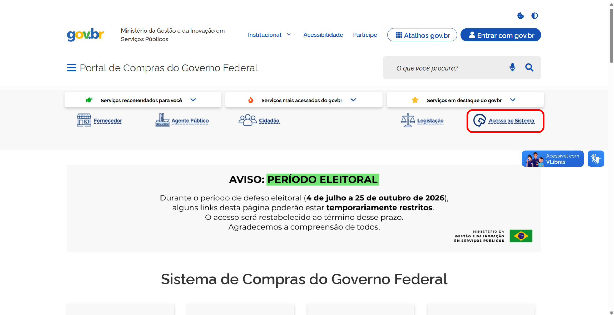
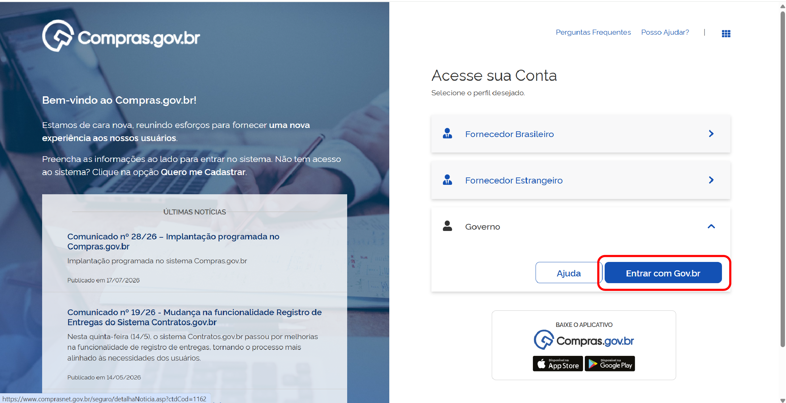
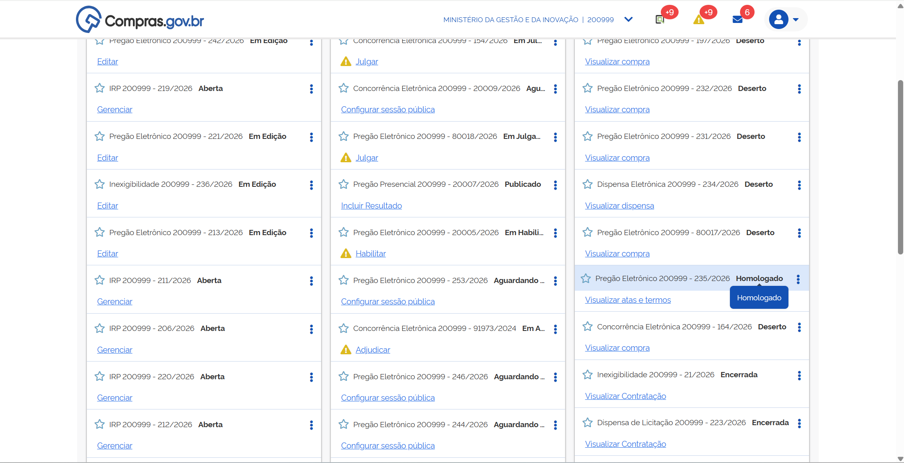
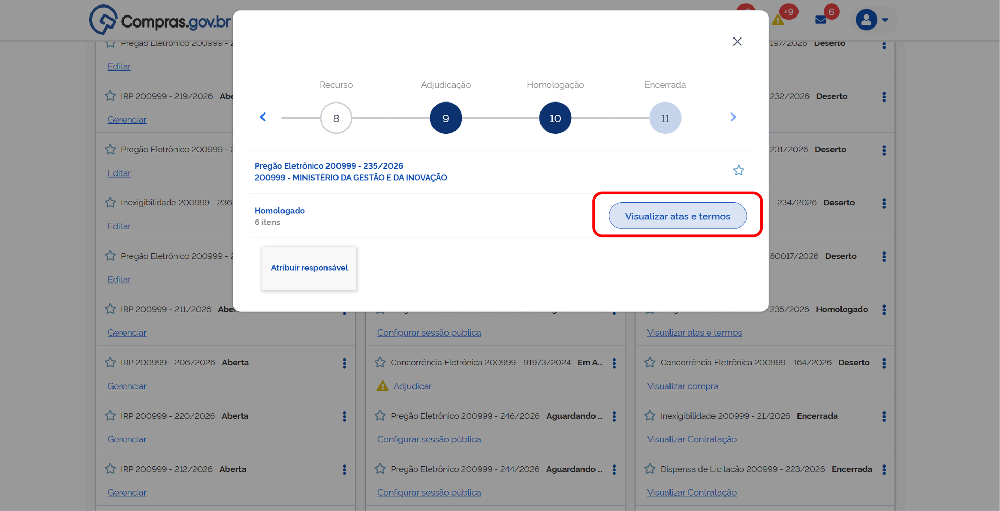
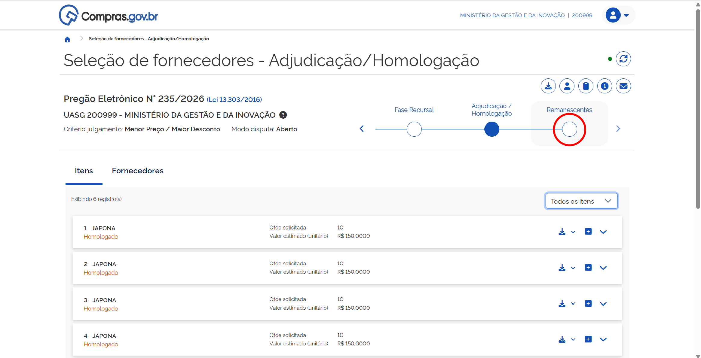

  Tamanho do texto:
  <button onclick="diminuirFonte()" title="Diminuir texto" style="padding: 6px 12px; font-weight: bold; cursor: pointer; border: 1px solid #ccc; border-radius: 4px; background: #f8f9fa;">A-</button>
  <button onclick="resetarFonte()" title="Tamanho normal" style="padding: 6px 12px; font-weight: bold; cursor: pointer; border: 1px solid #ccc; border-radius: 4px; background: #f8f9fa;">A</button>
  <button onclick="aumentarFonte()" title="Aumentar texto" style="padding: 6px 12px; font-weight: bold; cursor: pointer; border: 1px solid #ccc; border-radius: 4px; background: #f8f9fa;">A+</button>
  
  <button onclick="window.print()" style="background-color: #0056b3; color: white; padding: 6px 16px; border: none; border-radius: 5px; font-size: 14px; cursor: pointer; box-shadow: 0 2px 4px rgba(0,0,0,0.2); margin-left: 10px;">
    🖨️ Imprimir ou baixar esta página
  </button>

# ACESSANDO UMA CONTRATAÇÃO HOMOLOGADA

**Passo 1:** Acesse o [Portal de Compras do Governo Federal](https://www.gov.br/compras/pt-br) e clique em “Acesso ao Sistema”.

**Passo 2:** Escolha o perfil **Governo** e clique em “Entrar com Gov.br”.

**Passo 3:** Na área de trabalho do usuário Governo, localize sua contratação homologada na coluna “Compras Finalizadas”.

**Passo 4:** Selecione sua contratação e acesse “Visualizar atas e termos”.

**Passo 5:** Localize a linha do tempo, com a opção “Remanescentes” disponível para acesso.

 

  <button onclick="window.print()" style="background-color: #0056b3; color: white; padding: 10px 20px; border: none; border-radius: 5px; font-size: 16px; cursor: pointer; box-shadow: 0 2px 4px rgba(0,0,0,0.2);">
    🖨️ Imprimir ou baixar esta página
  </button>

