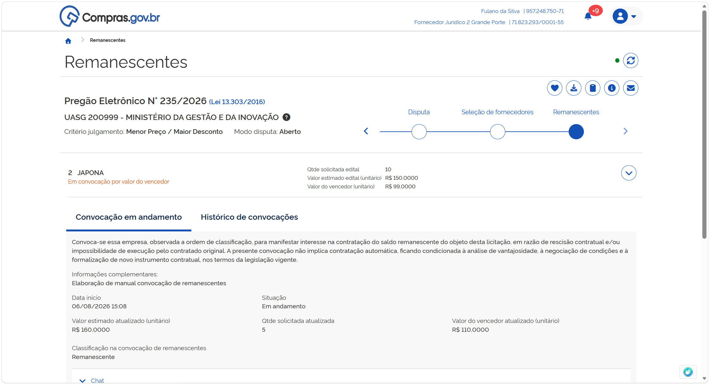

  Tamanho do texto:
  <button onclick="diminuirFonte()" title="Diminuir texto" style="padding: 6px 12px; font-weight: bold; cursor: pointer; border: 1px solid #ccc; border-radius: 4px; background: #f8f9fa;">A-</button>
  <button onclick="resetarFonte()" title="Tamanho normal" style="padding: 6px 12px; font-weight: bold; cursor: pointer; border: 1px solid #ccc; border-radius: 4px; background: #f8f9fa;">A</button>
  <button onclick="aumentarFonte()" title="Aumentar texto" style="padding: 6px 12px; font-weight: bold; cursor: pointer; border: 1px solid #ccc; border-radius: 4px; background: #f8f9fa;">A+</button>
  
  <button onclick="window.print()" style="background-color: #0056b3; color: white; padding: 6px 16px; border: none; border-radius: 5px; font-size: 14px; cursor: pointer; box-shadow: 0 2px 4px rgba(0,0,0,0.2); margin-left: 10px;">
    🖨️ Imprimir ou baixar esta página
  </button>

# MANIFESTANDO INTERESSE EM PARTICIPAR DE UMA CONVOCAÇÃO DE REMANESCENTES

A convocação de remanescentes acontecerá em duas etapas sucessivas:

* Aceite, para assumir o contrato pelo mesmo preço do licitante vencedor do processo licitatório;
* Caso a primeira etapa não tenha sucesso, será aberta a possibilidade de aceite para assumir o contrato após negociação de valor, incluindo a possibilidade de manter a proposta original do licitante interessado.

**Passo 1:** Para formalizar sua intenção de participar em uma convocação de remanescentes, selecione o item em que deseja atuar e clique em “Operar item”.

**Passo 2:** Leia as informações sobre o item, pois os valores podem ser atualizados.

**Passo 3:** No campo “Proposta”, será solicitada a manifestação interesse em participar da convocação de remanescentes na condição atual.

  <button onclick="window.print()" style="background-color: #0056b3; color: white; padding: 10px 20px; border: none; border-radius: 5px; font-size: 16px; cursor: pointer; box-shadow: 0 2px 4px rgba(0,0,0,0.2);">
    🖨️ Imprimir ou baixar esta página
  </button>

