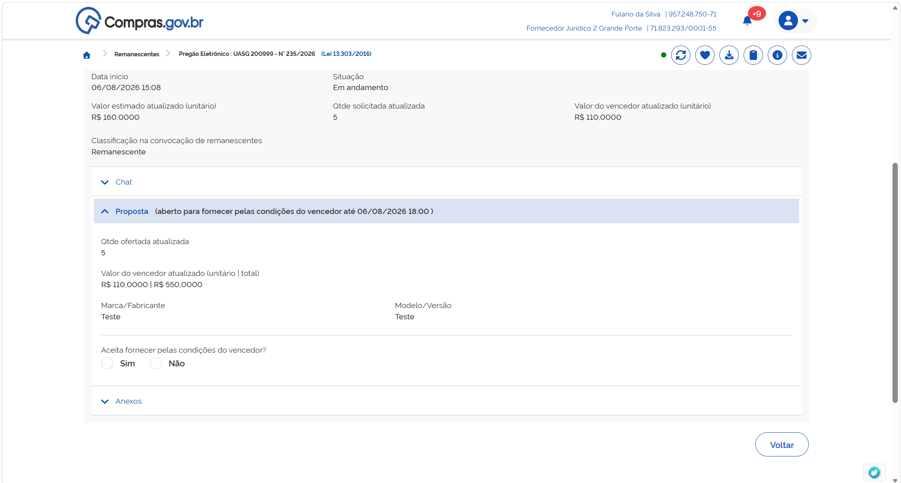
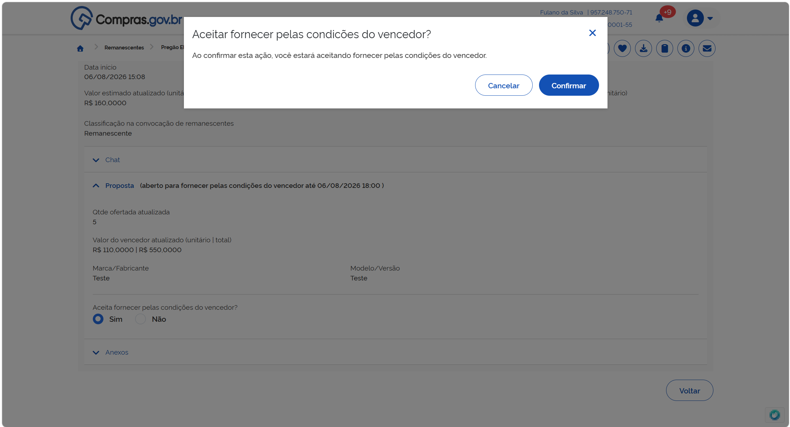
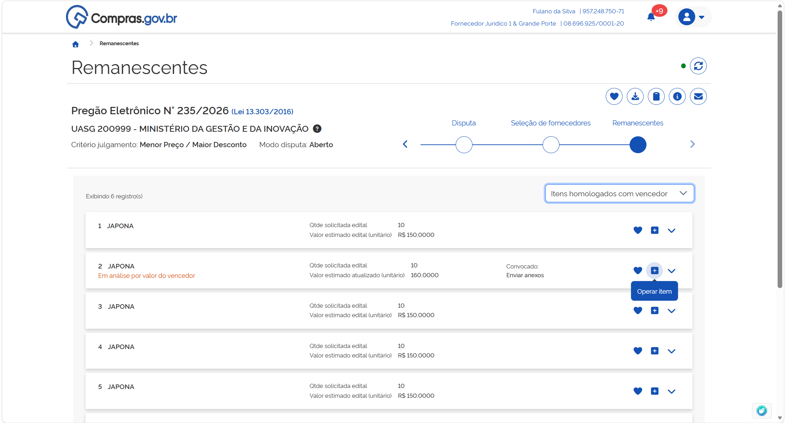
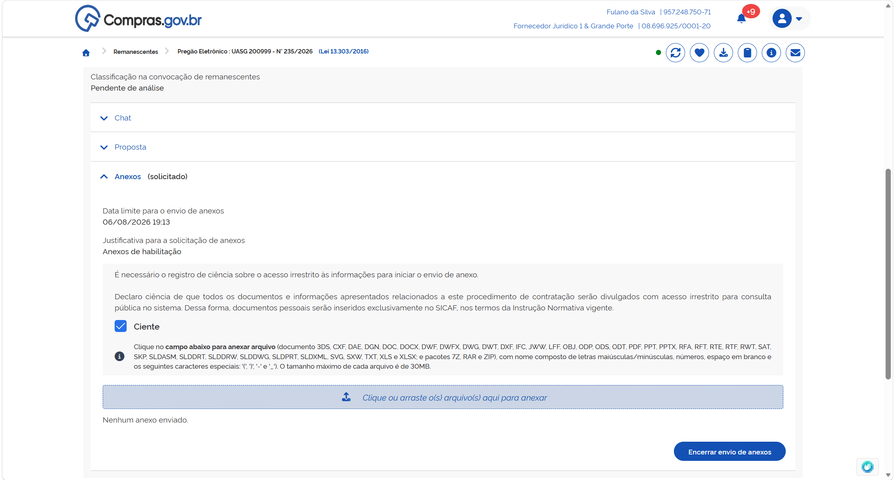
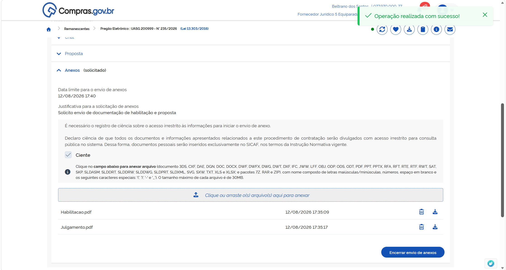
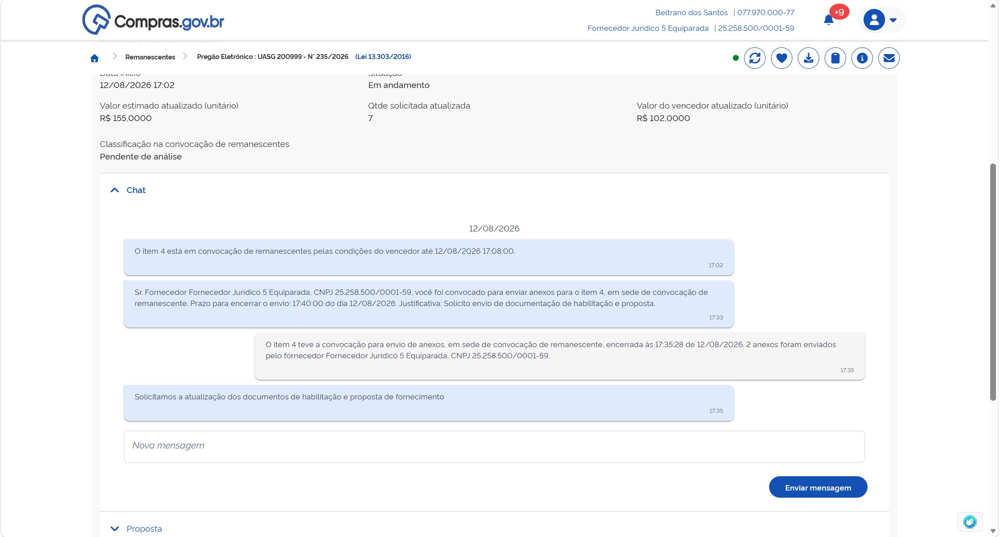

  Tamanho do texto:
  <button onclick="diminuirFonte()" title="Diminuir texto" style="padding: 6px 12px; font-weight: bold; cursor: pointer; border: 1px solid #ccc; border-radius: 4px; background: #f8f9fa;">A-</button>
  <button onclick="resetarFonte()" title="Tamanho normal" style="padding: 6px 12px; font-weight: bold; cursor: pointer; border: 1px solid #ccc; border-radius: 4px; background: #f8f9fa;">A</button>
  <button onclick="aumentarFonte()" title="Aumentar texto" style="padding: 6px 12px; font-weight: bold; cursor: pointer; border: 1px solid #ccc; border-radius: 4px; background: #f8f9fa;">A+</button>
  
  <button onclick="window.print()" style="background-color: #0056b3; color: white; padding: 6px 16px; border: none; border-radius: 5px; font-size: 14px; cursor: pointer; box-shadow: 0 2px 4px rgba(0,0,0,0.2); margin-left: 10px;">
    🖨️ Imprimir ou baixar esta página
  </button>

# CONVOCAÇÃO DE CONTRATAÇÃO DE REMANESCENTES PELAS CONDIÇÕES DO VENCEDOR

O processo de convocação de remanescentes começa pela oportunidade de assumir o contrato nas mesmas condições do fornecedor. Para manifestar se aceita ou assumir o contrato pelas condições do vencedor, siga as instruções abaixo:

**Passo 01:** No cabeçalho do campo proposta, será indicado o prazo para manifestação de interesse de fornecer pelas condições do vencedor. Revise as informações sobre as condições da contratação e selecione a opção desejada.

Confirme sua opção

**Passo 02:** Durante o prazo de manifestação indicado, você poderá alterar sua opção. Selecione a nova opção.

Confirme.

Quando o prazo do processo finalizar para todos os fornecedores que participaram do processo se manifestarem, o agente de contratação partirá para a etapa de habilitação e julgamento dessa convocação de remanescentes. 

**Passo 03:** Acesse o item em convocação de remanescentes selecionando a opção “Operar item”.

Para visualizar quais documentos foram solicitados, acesse a seção “Anexos”.

Leia a justificativa e o conteúdo da solicitação e encaminhe os documentos necessários. Para isso, leia os avisos de sistema e declare ciência.

Anexe todos os arquivos clicando no local indicado ou arrastando os arquivos para essa área. Finalize o carregamento de todos os documentos e clique em “Encerrar envio de anexos”.

**Passo 04:** Para visualizar e responder as mensagens encaminhadas pelo agente de contratação responsável, selecione a seção “Chat”.

Essa área serve para comunicação entre as partes, caso haja dúvidas sobre o processo. Preencha a mensagem desejada e clique em “Enviar” para encaminhá-la ao agente de contratação.

**Passo 05:** Caso a documentação da proposta de fornecimento não atenda aos requisitos de edital, o fornecedor será desclassificado. Assim, ficará na tela a indicação “Classificação na convocação de remanescente: Desclassificado”.

O fornecedor não estará apto a participar novamente desta convocação de remanescente enquanto o status de “Desclassificado” persistir.

!!! warning "Atenção"
    Recursos referentes à desclassificação deverão ser encaminhados diretamente ao órgão contratante.

**Passo 06:** Caso a documentação de habilitação não atenda aos requisitos de edital, o fornecedor será inabilitado. Assim, ficará na tela a indicação “Classificação na convocação de remanescente: Inabilitado”.

O fornecedor não estará apto a participar novamente desta convocação de remanescente enquanto o status de “Inabilitado” persistir.

!!! warning "Atenção"
    Recursos referentes à desclassificação deverão ser encaminhados diretamente ao órgão contratante.

**Passo 07:** Caso toda a documentação apresentada esteja de acordo com as exigências de edital, o fornecedor será aceito para fornecimento de remanescente contratual. Assim, ficará na tela a indicação “Classificação na convocação de remanescente: Aceito e habilitado”.

**Passo 08:** Para a formalizar o processo, o agente de contratação encerrará a convocação de remanescentes. Assim, ficará na tela a indicação “Situação: Encerrada”.

  <button onclick="window.print()" style="background-color: #0056b3; color: white; padding: 10px 20px; border: none; border-radius: 5px; font-size: 16px; cursor: pointer; box-shadow: 0 2px 4px rgba(0,0,0,0.2);">
    🖨️ Imprimir ou baixar esta página
  </button>

