

  Tamanho do texto:
  <button onclick="diminuirFonte()" title="Diminuir texto" style="padding: 6px 12px; font-weight: bold; cursor: pointer; border: 1px solid #ccc; border-radius: 4px; background: #f8f9fa;">A-</button>
  <button onclick="resetarFonte()" title="Tamanho normal" style="padding: 6px 12px; font-weight: bold; cursor: pointer; border: 1px solid #ccc; border-radius: 4px; background: #f8f9fa;">A</button>
  <button onclick="aumentarFonte()" title="Aumentar texto" style="padding: 6px 12px; font-weight: bold; cursor: pointer; border: 1px solid #ccc; border-radius: 4px; background: #f8f9fa;">A+</button>
  
  <button onclick="window.print()" style="background-color: #0056b3; color: white; padding: 6px 16px; border: none; border-radius: 5px; font-size: 14px; cursor: pointer; box-shadow: 0 2px 4px rgba(0,0,0,0.2); margin-left: 10px;">
    🖨️ Imprimir ou baixar esta página
  </button>

# ANALISANDO FORNECEDORES – ACEITE PARA NEGOCIAÇÃO

**Passo 1:** Para iniciar uma convocação para negociação com fornecedores, acesse o item clicando em “+ (Operar item)”.

**Passo 2:** Clique em “Convocar remanescentes para negociação”.

**Passo 3:** Preencha o campo “Data limite para convocação de remanescente” para definir o prazo para manifestação de interesse pelos fornecedores e confirme. 

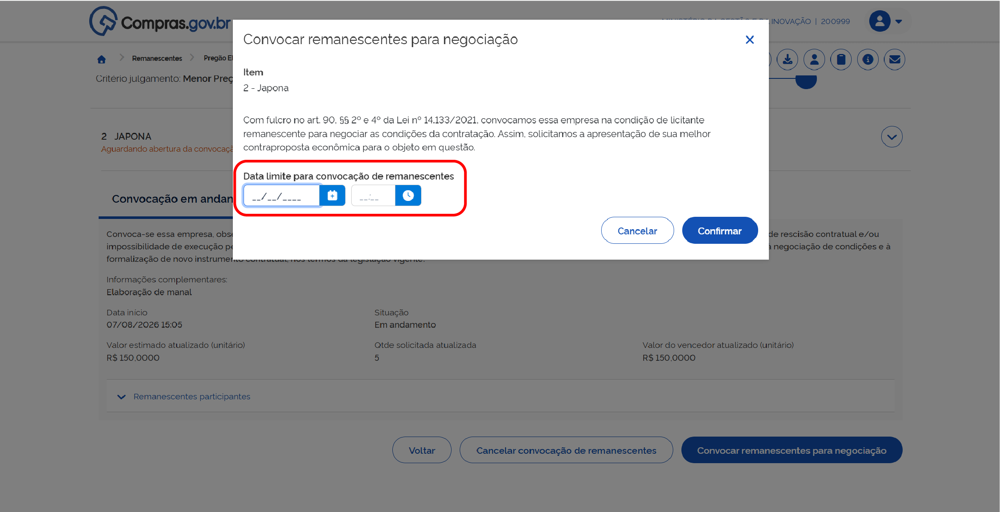

**Passo 4:** O prazo final foi definido. Caso deseje alterar data e/ou horário final, clique em “Alterar data limite para negociação”.

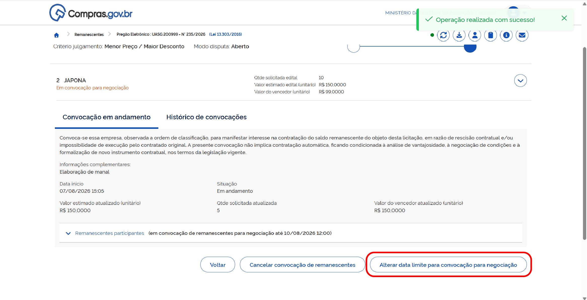

**Passo 5:** Finalizado o prazo dado aos fornecedores, retorne ao item e clique em “Operar item”.

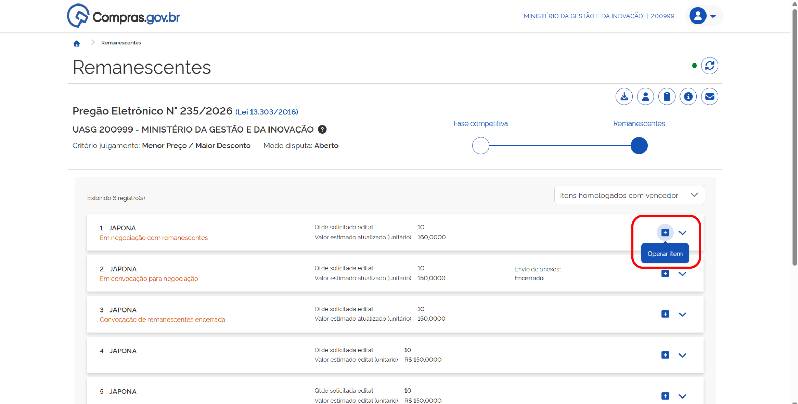

**Passo 6:** A lista de fornecedores estará na ordem em que deve ser analisada, considerando a classificação dos fornecedores na licitação original.

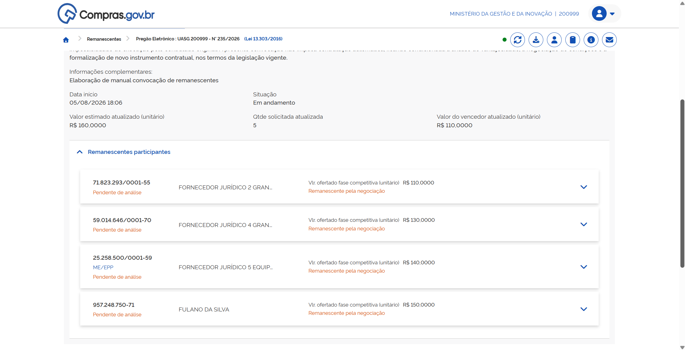

!!! note "Procedimentos Repetidos da Etapa Anterior"
    * Para solicitar envio de anexos, siga os passos 2 e 3 da seção **[Analisando Fornecedores – Aceite pelo Preço do Vencedor](03-analisando-fornecedores-vencedor.md)**.
    * Para envio de mensagens, siga o passo 4 da seção **[Analisando Fornecedores – Aceite pelo Preço do Vencedor](03-analisando-fornecedores-vencedor.md)**.
    * Para desclassificar o participante, siga o passo 5 da seção **[Analisando Fornecedores – Aceite pelo Preço do Vencedor](03-analisando-fornecedores-vencedor.md)**.
    * Para inabilitar o participante, siga o passo 6 da seção **[Analisando Fornecedores – Aceite pelo Preço do Vencedor](03-analisando-fornecedores-vencedor.md)**.

Para iniciar a negociação, expanda as informações do fornecedor e selecione a opção “Negociar”.

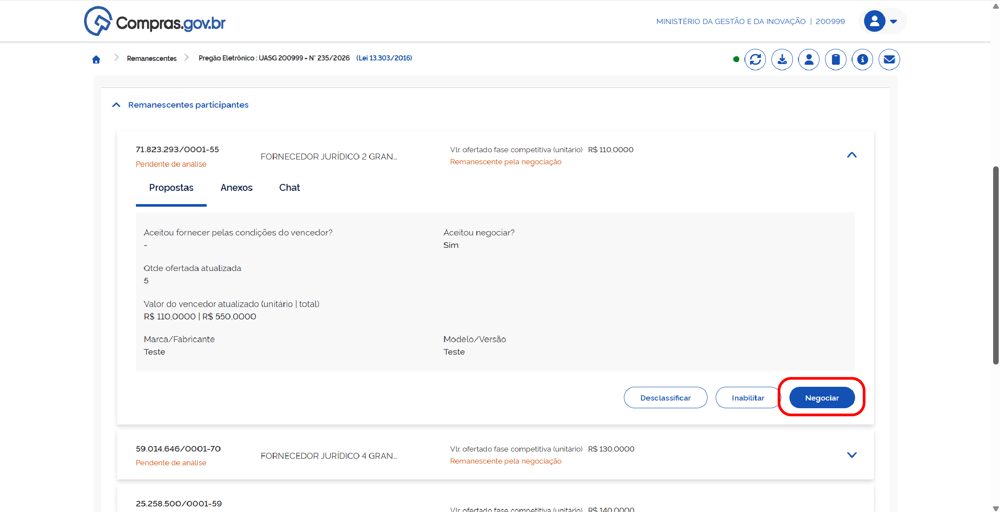

Preencha os campos de “Valor sugerido” e “Justificativa” e confirme.

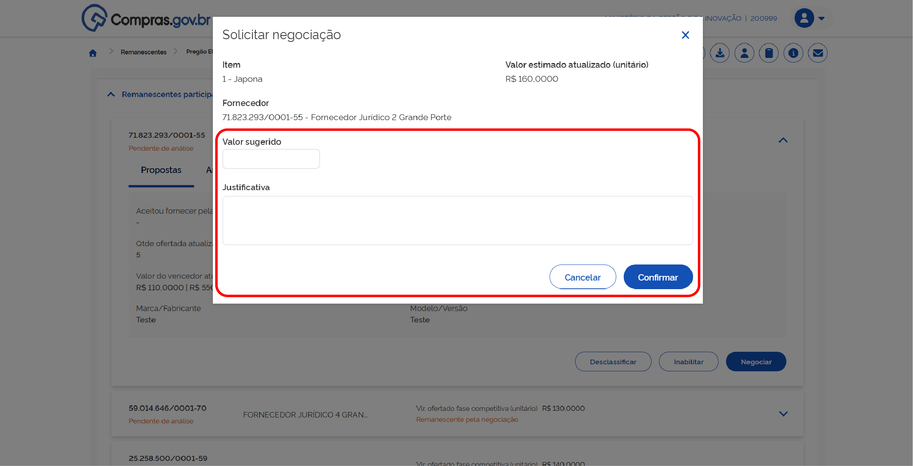

A negociação foi iniciada.

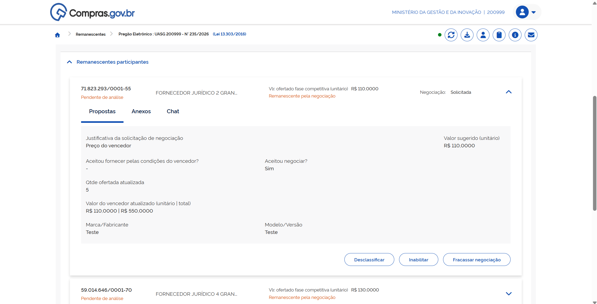

**Passo 7:** Caso o fornecedor faça uma contraproposta para a negociação, analise o pedido. Se preferir iniciar uma nova negociação, clique em “Negociar”.

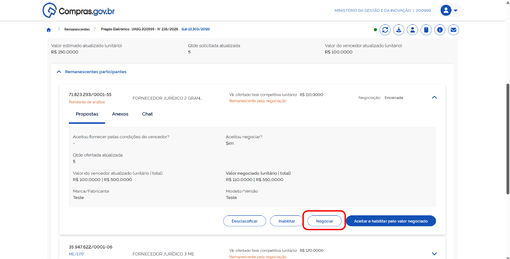

Preencha os dados da nova negociação e confirme.

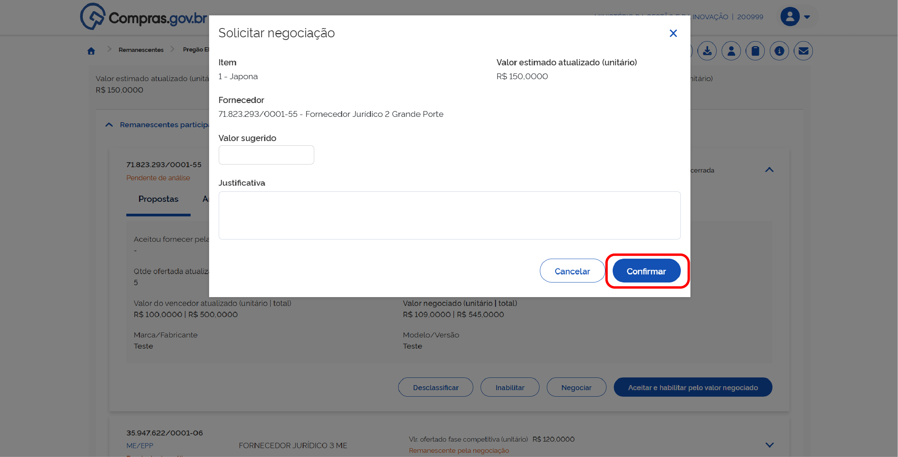

Caso aceite a contraproposta do fornecedor, clique em “Aceitar e habilitar pelo valor negociado”.

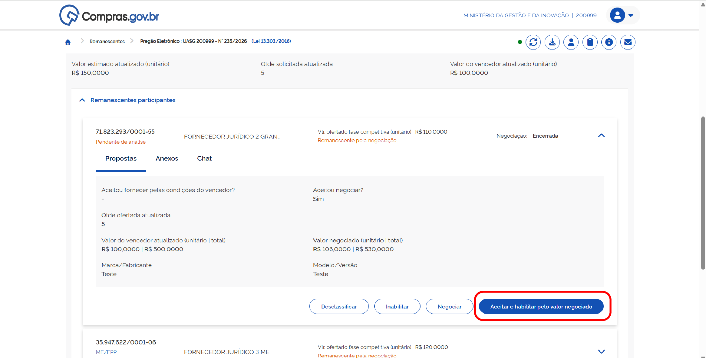

Escreva a justificativa e confirme.

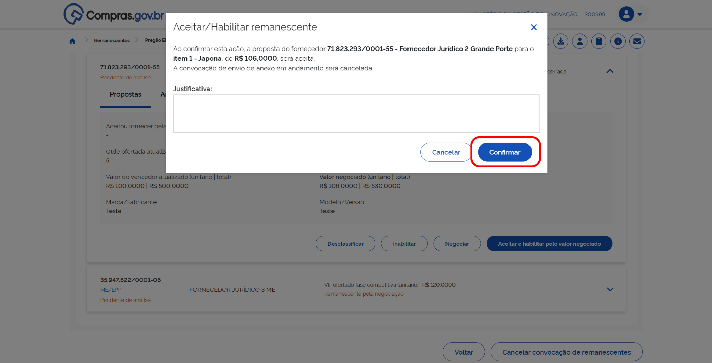

Clique em “Encerrar convocação de remanescentes”.

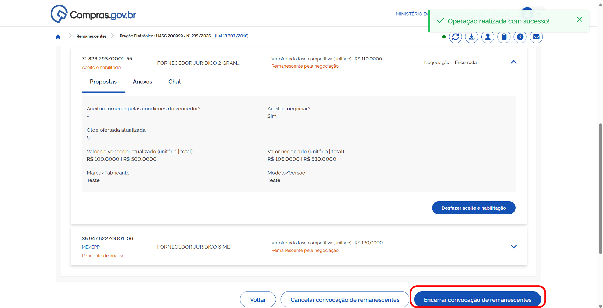

Escreva a justificativa e confirme.

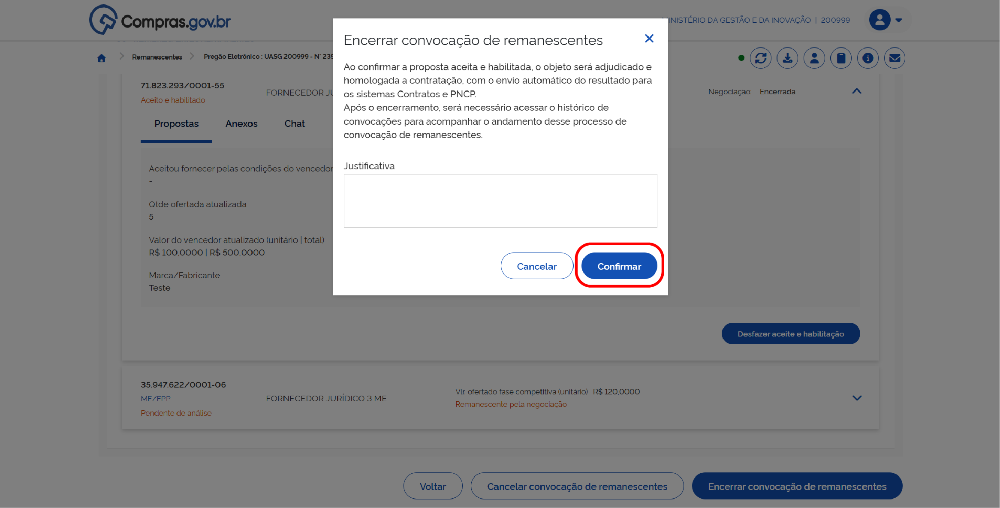

**Passo 8:** Caso o fornecedor rejeite a negociação, o sistema apresentará indicação de negociação fracassada.

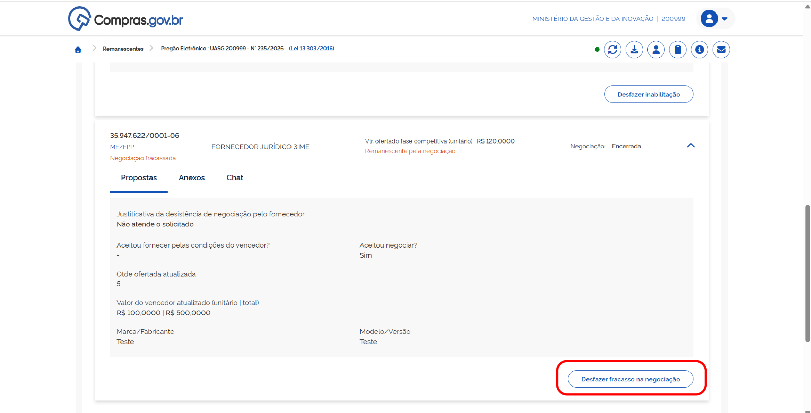

O servidor público responsável pela negociação poderá escolher entre:

* “Desfazer fracasso na negociação”, opção que reabrirá a negociação com este fornecedor;
* Negociar com o próximo fornecedor habilitado para esta etapa;
* Ou encerrar o processo de convocação de remanescentes.

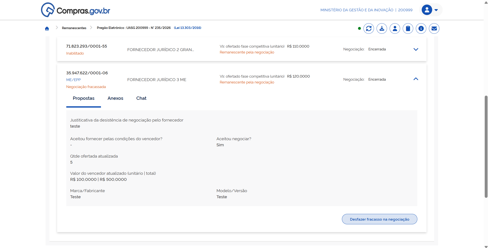

**Passo 9:** Caso o fornecedor aceite a proposta, selecione “Aceitar e habilitar pelo valor negociado”.

Escreva a justificativa e confirme.

Clique em “Encerrar convocação de remanescentes”

Escreva a justificativa e confirme.

 

  <button onclick="window.print()" style="background-color: #0056b3; color: white; padding: 10px 20px; border: none; border-radius: 5px; font-size: 16px; cursor: pointer; box-shadow: 0 2px 4px rgba(0,0,0,0.2);">
    🖨️ Imprimir ou baixar esta página
  </button>

