

  Tamanho do texto:
  <button onclick="diminuirFonte()" title="Diminuir texto" style="padding: 6px 12px; font-weight: bold; cursor: pointer; border: 1px solid #ccc; border-radius: 4px; background: #f8f9fa;">A-</button>
  <button onclick="resetarFonte()" title="Tamanho normal" style="padding: 6px 12px; font-weight: bold; cursor: pointer; border: 1px solid #ccc; border-radius: 4px; background: #f8f9fa;">A</button>
  <button onclick="aumentarFonte()" title="Aumentar texto" style="padding: 6px 12px; font-weight: bold; cursor: pointer; border: 1px solid #ccc; border-radius: 4px; background: #f8f9fa;">A+</button>
  
  <button onclick="window.print()" style="background-color: #0056b3; color: white; padding: 6px 16px; border: none; border-radius: 5px; font-size: 14px; cursor: pointer; box-shadow: 0 2px 4px rgba(0,0,0,0.2); margin-left: 10px;">
    🖨️ Imprimir ou baixar esta página
  </button>

# CONVOCAÇÃO POR NEGOCIAÇÃO DE PREÇOS

Caso a primeira etapa não tenha sucesso, será aberta a possibilidade de aceite para assumir o contrato após negociação de valor, incluindo a possibilidade de manter a proposta original do licitante interessado.

**Passo 01:** Acesse a contratação com status “Em convocação para negociação”, selecionando o ícone “Operar item”. 

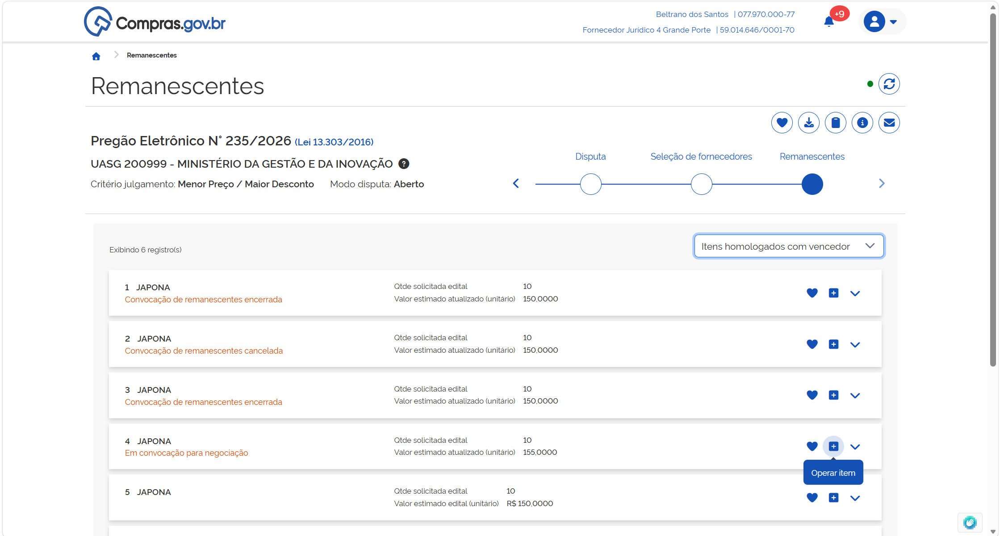

**Passo 02:** No cabeçalho do campo proposta, será indicado o prazo para manifestar interesse para negociar. Revise as informações sobre as condições da contratação e selecione a opção desejada.

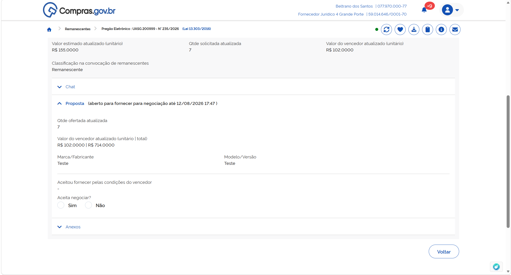

Confirme sua opção.

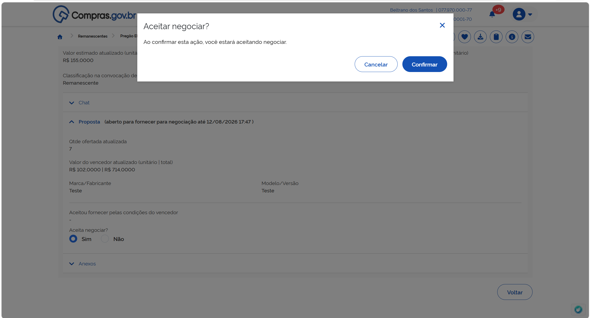

**Passo 03:** Durante o prazo de manifestação indicado, você poderá alterar sua opção. Selecione a nova opção

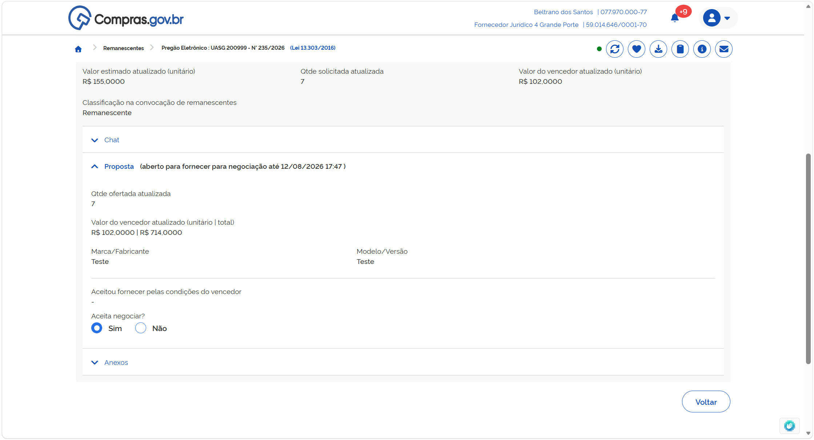

E confirme a opção.

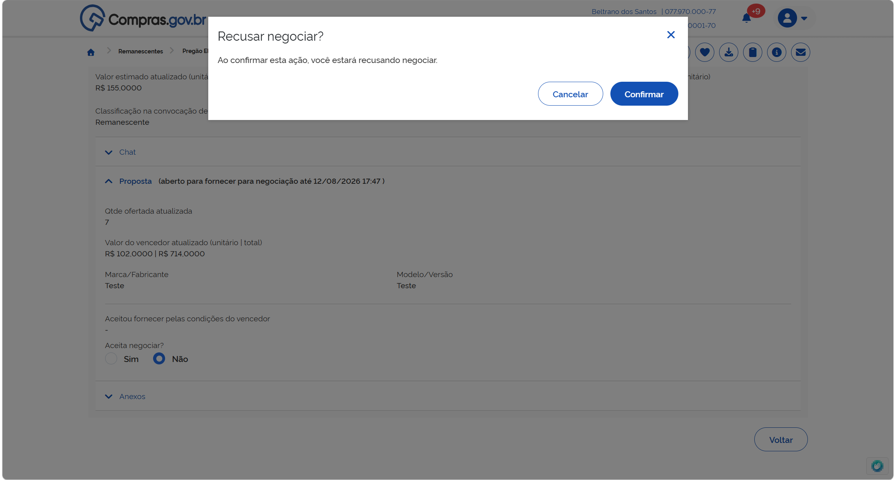

**Passo 04:** Depois que terminar o prazo para manifestação de todos os fornecedores que participaram do processo, o agente de contratação fará a negociação com o fornecedor mais bem classificado no processo. 

Retorne ao item em convocação acessando a opção “Operar item”.

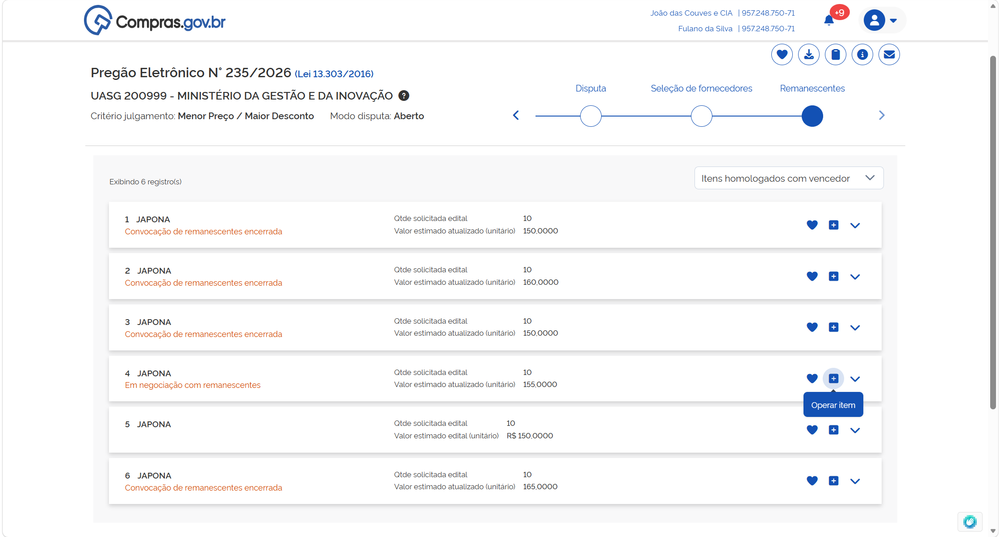

Acesse a seção “Proposta” para visualizar os detalhes da negociação.

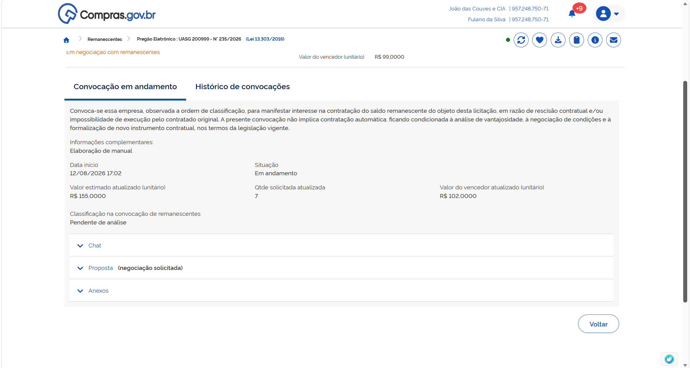

O valor proposto pela administração aparecerá indicado no campo “Valor sugerido”. Você poderá “Desistir de participar pelo valor negociado”, “Confirmar o valor negociado”, ou fazer uma contraproposta.

**Passo 05:** Caso não deseje prosseguir no processo, seleciona “Desistir de participar pelo valor negociado”.

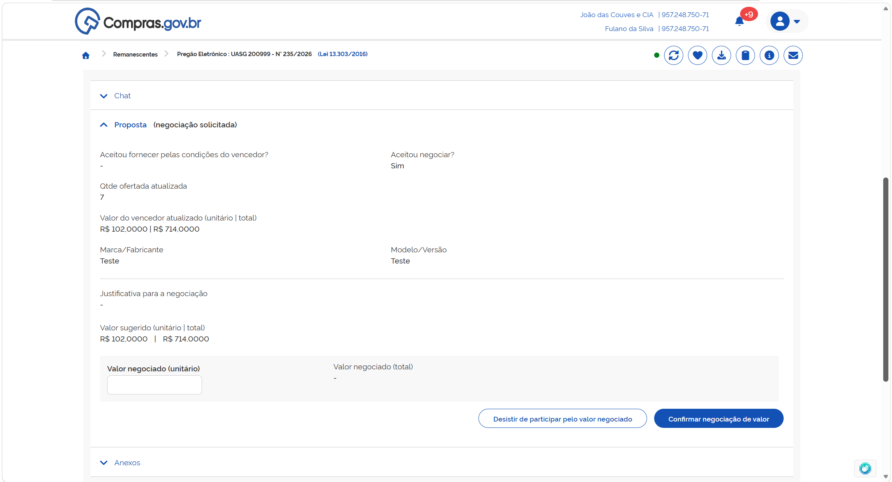

Preencha o campo de justificativa e confirme.

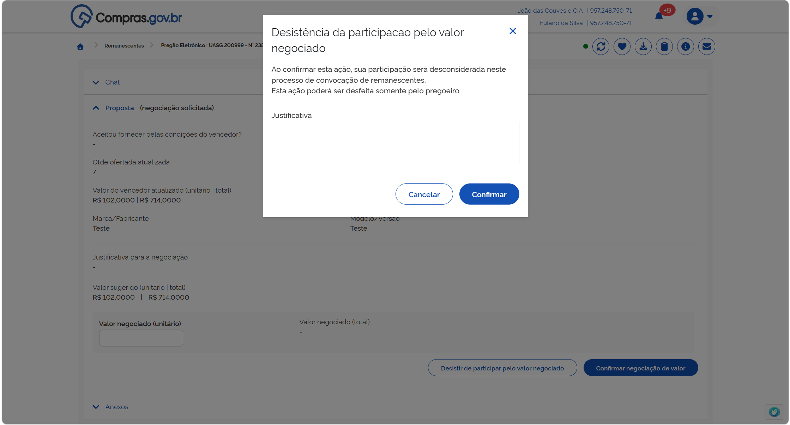

!!! warning "Atenção"
    Essa opção não poderá ser desfeita por você, apenas pelo agente de contratação/pregoeiro

**Passo 06:** Caso deseje aceitar o valor proposto pela Administração, preencha o campo “Valor negociado (unitário)” com o valor proposto pelo agente de contratação/pregoeiro e confirme a opção.

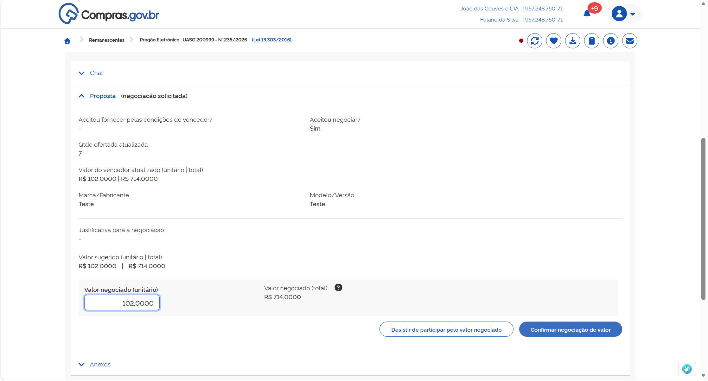

**Passo 07:** Caso deseje fazer uma contraproposta, preencha o campo “Valor negociado (unitário)” com o novo valor proposto e confirma e opção.

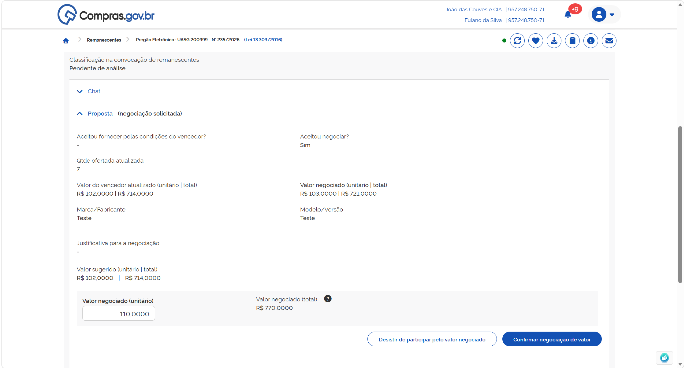

O agente de contratação poderá aceitar sua contraproposta ou iniciar uma nova negociação. Repita esse processo até que cheguem a uma negociação final.

!!! note "Nota"
    Para envio de documentos solicitados para habilitação e julgamento, siga o passo 3 da seção **[Convocação de contratação de remanescentes pelas condições do vencedor](03-condicoes-vencedor.md)**.

    Para envio de mensagens, siga o passo 4 da seção **[Convocação de contratação de remanescentes pelas condições do vencedor](03-condicoes-vencedor.md)**.

    Caso o fornecedor seja desclassificado, leia as informações constantes no passo 5 da seção **[Convocação de contratação de remanescentes pelas condições do vencedor](03-condicoes-vencedor.md)**.

    Caso o fornecedor seja inabilitado, leia as informações constantes no passo 6 da seção **[Convocação de contratação de remanescentes pelas condições do vencedor](03-condicoes-vencedor.md)**.

**Passo 08:** Caso toda a documentação apresentada esteja de acordo com as exigências de edital, o fornecedor será aceito para fornecimento de remanescente contratual. Com isso, ficará na tela a indicação “Classificação na convocação de remanescente: Aceito e habilitado”.

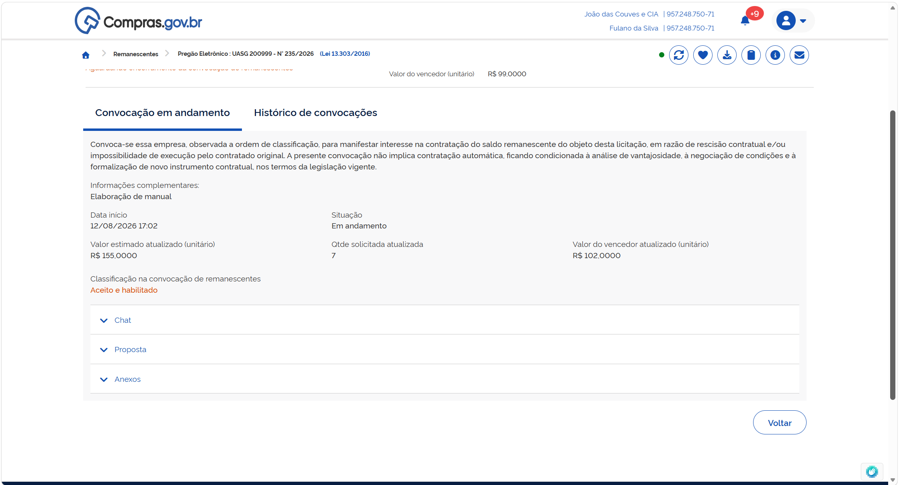

**Passo 09:** Para a formalização do processo, o agente de contratação deve encerrar a convocação de remanescentes. Com isso, ficará na tela a indicação “Situação: Encerrada”.

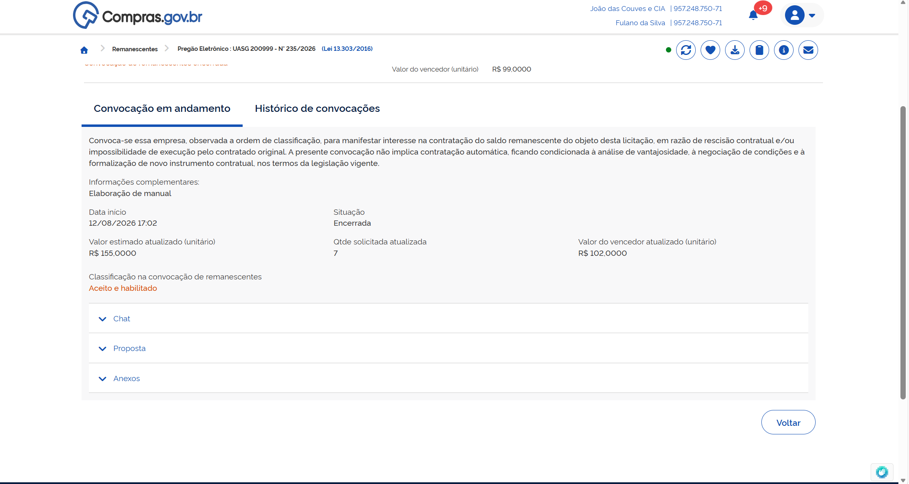

  <button onclick="window.print()" style="background-color: #0056b3; color: white; padding: 10px 20px; border: none; border-radius: 5px; font-size: 16px; cursor: pointer; box-shadow: 0 2px 4px rgba(0,0,0,0.2);">
    🖨️ Imprimir ou baixar esta página
  </button>

