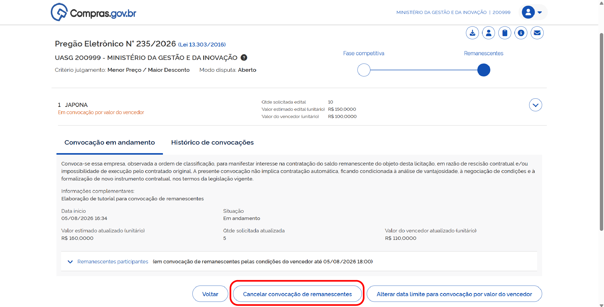
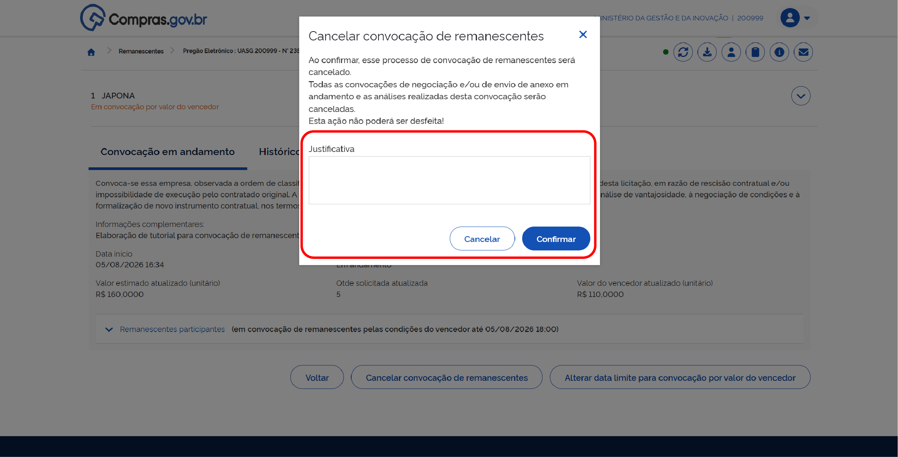
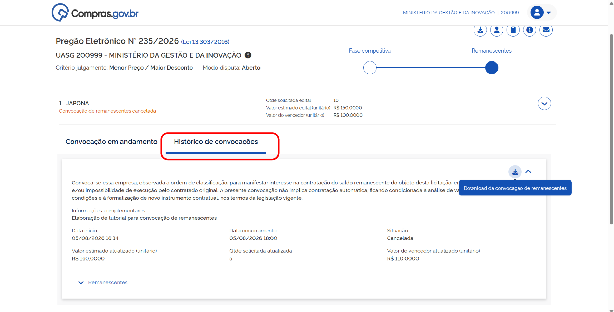
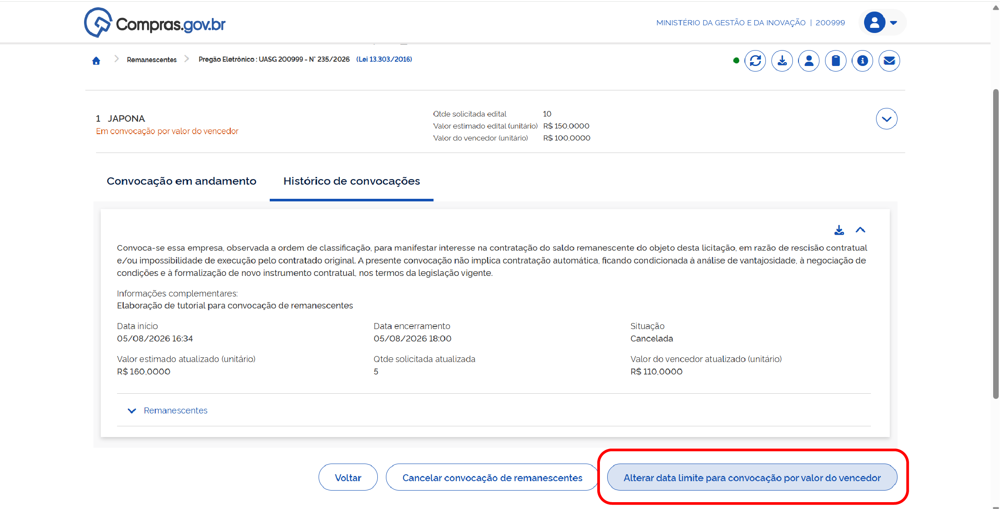
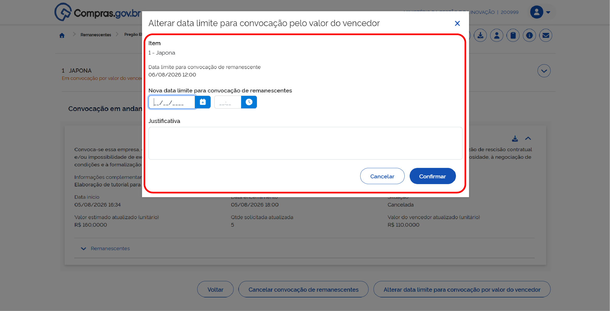

  Tamanho do texto:
  <button onclick="diminuirFonte()" title="Diminuir texto" style="padding: 6px 12px; font-weight: bold; cursor: pointer; border: 1px solid #ccc; border-radius: 4px; background: #f8f9fa;">A-</button>
  <button onclick="resetarFonte()" title="Tamanho normal" style="padding: 6px 12px; font-weight: bold; cursor: pointer; border: 1px solid #ccc; border-radius: 4px; background: #f8f9fa;">A</button>
  <button onclick="aumentarFonte()" title="Aumentar texto" style="padding: 6px 12px; font-weight: bold; cursor: pointer; border: 1px solid #ccc; border-radius: 4px; background: #f8f9fa;">A+</button>
  
  <button onclick="window.print()" style="background-color: #0056b3; color: white; padding: 6px 16px; border: none; border-radius: 5px; font-size: 14px; cursor: pointer; box-shadow: 0 2px 4px rgba(0,0,0,0.2); margin-left: 10px;">
    🖨️ Imprimir ou baixar esta página
  </button>

# CANCELANDO, HISTÓRICO E ALTERAÇÃO DE DATA

## CANCELANDO UMA CONVOCAÇÃO DE REMANESCENTES

A qualquer momento, você poderá cancelar sua convocação de remanescentes.

**Passo 1:** Selecione a opção “Cancelar convocação de remanescente”.

**Passo 2:** Preencha o campo de justificativa para o cancelamento e salve.

!!! warning "Atenção"
    Essa ação não poderá ser desfeita. Caso seja necessário, inicie um novo processo de convocação de remanescentes.

---

## HISTÓRICO DE CONVOCAÇÃO

Na aba “Histórico de convocação”, você poderá visualizar as informações de todas as convocações de remanescentes já finalizadas e fazer download de relatório de cada ocorrência.

---

## ALTERANDO A DATA LIMITE DA CONVOCAÇÃO

Caso seja necessário alterar data ou horário limite da convocação, selecione a opção “Alterar data limite para convocação”.

Preencha os novos dados da data limite e o campo de justificativa, e salve.

 

  <button onclick="window.print()" style="background-color: #0056b3; color: white; padding: 10px 20px; border: none; border-radius: 5px; font-size: 16px; cursor: pointer; box-shadow: 0 2px 4px rgba(0,0,0,0.2);">
    🖨️ Imprimir ou baixar esta página
  </button>

