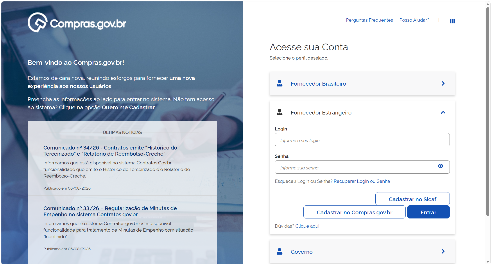
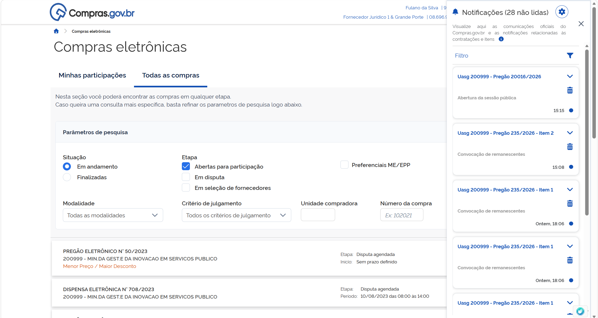
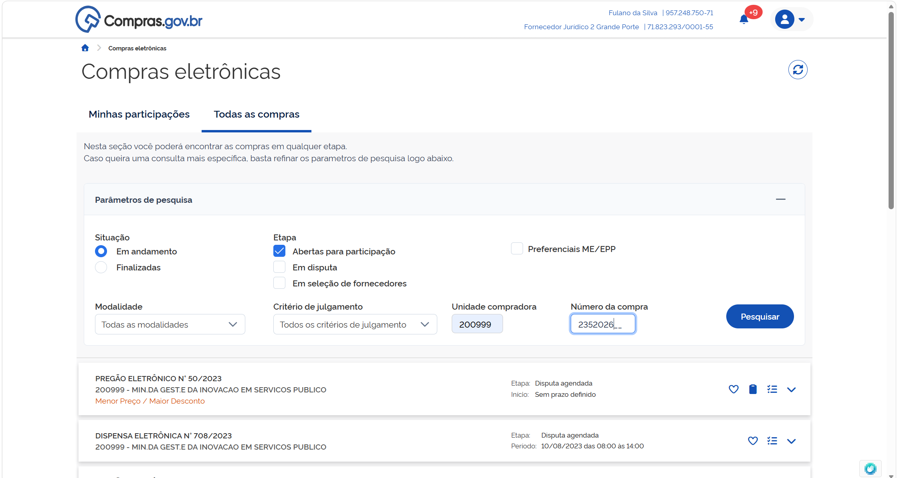

  Tamanho do texto:
  <button onclick="diminuirFonte()" title="Diminuir texto" style="padding: 6px 12px; font-weight: bold; cursor: pointer; border: 1px solid #ccc; border-radius: 4px; background: #f8f9fa;">A-</button>
  <button onclick="resetarFonte()" title="Tamanho normal" style="padding: 6px 12px; font-weight: bold; cursor: pointer; border: 1px solid #ccc; border-radius: 4px; background: #f8f9fa;">A</button>
  <button onclick="aumentarFonte()" title="Aumentar texto" style="padding: 6px 12px; font-weight: bold; cursor: pointer; border: 1px solid #ccc; border-radius: 4px; background: #f8f9fa;">A+</button>
  
  <button onclick="window.print()" style="background-color: #0056b3; color: white; padding: 6px 16px; border: none; border-radius: 5px; font-size: 14px; cursor: pointer; box-shadow: 0 2px 4px rgba(0,0,0,0.2); margin-left: 10px;">
    🖨️ Imprimir ou baixar esta página
  </button>

PÚBLICO-ALVO: FORNECEDORES

# Como participar de uma convocação de remanescentes no Compras.gov.br

Utilize o sistema Compras.gov.br para participar de uma convocação de remanescentes em processos de contratação. Após a homologação de um processo do qual você participou e não venceu, é possível participar de convocações de remanescentes iniciadas pelo órgão contratante.

 

# ACESSANDO UMA CONTRATAÇÃO HOMOLOGADA

**Passo 1:** Acesse o [Portal de Compras do Governo Federal](https://www.gov.br/compras/pt-br) e clique em “Acesso ao Sistema”. 

**Passo 2:** Escolha o perfil **Fornecedor Nacional** e clique em “Entrar com Gov.br”.

Ou selecione o perfil **Fornecedor Estrangeiro** e utilize suas credenciais para acessar o sistema.

**Passo 3:** No menu “Compras”, acesse a opção “Licitação e dispensas (novo)”.

**Passo 4:** Você poderá acessar uma convocação de remanescentes nas notificações do sistema (na lateral direita) (tela 05)

ou usando a pesquisa na aba “Todas as Compras”, procurando pelo número da contratação desejada.

**Passo 5:** Acesse a contratação clicando na opção “Acompanhar compra”.

**Passo 6:** Acesse a linha do tempo da contratação em **Remanescentes**.

 

# MANIFESTANDO INTERESSE EM PARTICIPAR DE UMA CONVOCAÇÃO DE REMANESCENTES

A convocação de remanescentes acontecerá em duas etapas sucessivas:

* Aceite, para assumir o contrato pelo mesmo preço do licitante vencedor do processo licitatório;
* Caso a primeira etapa não tenha sucesso, será aberta a possibilidade de aceite para assumir o contrato após negociação de valor, incluindo a possibilidade de manter a proposta original do licitante interessado.

**Passo 1:** Para formalizar sua intenção de participar em uma convocação de remanescentes, selecione o item em que deseja atuar e clique em “Operar item”.

**Passo 2:** Leia as informações sobre o item, pois os valores podem ser atualizados.

**Passo 3:** No campo “Proposta”, será solicitada a manifestação interesse em participar da convocação de remanescentes na condição atual.

 

# CONVOCAÇÃO DE CONTRATAÇÃO DE REMANESCENTES PELAS CONDIÇÕES DO VENCEDOR

O processo de convocação de remanescentes começa pela oportunidade de assumir o contrato nas mesmas condições do fornecedor. Para manifestar se aceita ou assumir o contrato pelas condições do vencedor, siga as instruções abaixo:

**Passo 01:** No cabeçalho do campo proposta, será indicado o prazo para manifestação de interesse de fornecer pelas condições do vencedor. Revise as informações sobre as condições da contratação e selecione a opção desejada.

Confirme sua opção

**Passo 02:** Durante o prazo de manifestação indicado, você poderá alterar sua opção. Selecione a nova opção.

Confirme.

Quando o prazo do processo finalizar para todos os fornecedores que participaram do processo se manifestarem, o agente de contratação partirá para a etapa de habilitação e julgamento dessa convocação de remanescentes. 

**Passo 03:** Acesse o item em convocação de remanescentes selecionando a opção “Operar item”.

Para visualizar quais documentos foram solicitados, acesse a seção “Anexos”.

Leia a justificativa e o conteúdo da solicitação e encaminhe os documentos necessários. Para isso, leia os avisos de sistema e declare ciência.

Anexe todos os arquivos clicando no local indicado ou arrastando os arquivos para essa área. Finalize o carregamento de todos os documentos e clique em “Encerrar envio de anexos”.

**Passo 04:** Para visualizar e responder as mensagens encaminhadas pelo agente de contratação responsável, selecione a seção “Chat”.

Essa área serve para comunicação entre as partes, caso haja dúvidas sobre o processo. Preencha a mensagem desejada e clique em “Enviar” para encaminhá-la ao agente de contratação.

**Passo 05:** Caso a documentação da proposta de fornecimento não atenda aos requisitos de edital, o fornecedor será desclassificado. Assim, ficará na tela a indicação “Classificação na convocação de remanescente: Desclassificado”.

O fornecedor não estará apto a participar novamente desta convocação de remanescente enquanto o status de “Desclassificado” persistir.

!!! warning "Atenção"
    Recursos referentes à desclassificação deverão ser encaminhados diretamente ao órgão contratante.

**Passo 06:** Caso a documentação de habilitação não atenda aos requisitos de edital, o fornecedor será inabilitado. Assim, ficará na tela a indicação “Classificação na convocação de remanescente: Inabilitado”.

O fornecedor não estará apto a participar novamente desta convocação de remanescente enquanto o status de “Inabilitado” persistir.

!!! warning "Atenção"
    Recursos referentes à desclassificação deverão ser encaminhados diretamente ao órgão contratante.

**Passo 07:** Caso toda a documentação apresentada esteja de acordo com as exigências de edital, o fornecedor será aceito para fornecimento de remanescente contratual. Assim, ficará na tela a indicação “Classificação na convocação de remanescente: Aceito e habilitado”.

**Passo 08:** Para a formalizar o processo, o agente de contratação encerrará a convocação de remanescentes. Assim, ficará na tela a indicação “Situação: Encerrada”.

 

# CONVOCAÇÃO POR NEGOCIAÇÃO DE PREÇOS

Caso a primeira etapa não tenha sucesso, será aberta a possibilidade de aceite para assumir o contrato após negociação de valor, incluindo a possibilidade de manter a proposta original do licitante interessado.

**Passo 01:** Acesse a contratação com status “Em convocação para negociação”, selecionando o ícone “Operar item”. 

**Passo 02:** No cabeçalho do campo proposta, será indicado o prazo para manifestar interesse para negociar. Revise as informações sobre as condições da contratação e selecione a opção desejada.

Confirme sua opção.

**Passo 03:** Durante o prazo de manifestação indicado, você poderá alterar sua opção. Selecione a nova opção

E confirme a opção.

**Passo 04:** Depois que terminar o prazo para manifestação de todos os fornecedores que participaram do processo, o agente de contratação fará a negociação com o fornecedor mais bem classificado no processo. 

Retorne ao item em convocação acessando a opção “Operar item”.

Acesse a seção “Proposta” para visualizar os detalhes da negociação.

O valor proposto pela administração aparecerá indicado no campo “Valor sugerido”. Você poderá “Desistir de participar pelo valor negociado”, “Confirmar o valor negociado”, ou fazer uma contraproposta.

**Passo 05:** Caso não deseje prosseguir no processo, seleciona “Desistir de participar pelo valor negociado”.

Preencha o campo de justificativa e confirme.

!!! warning "Atenção"
    Essa opção não poderá ser desfeita por você, apenas pelo agente de contratação/pregoeiro

**Passo 06:** Caso deseje aceitar o valor proposto pela Administração, preencha o campo “Valor negociado (unitário)” com o valor proposto pelo agente de contratação/pregoeiro e confirme a opção.

**Passo 07:** Caso deseje fazer uma contraproposta, preencha o campo “Valor negociado (unitário)” com o novo valor proposto e confirma e opção.

O agente de contratação poderá aceitar sua contraproposta ou iniciar uma nova negociação. Repita esse processo até que cheguem a uma negociação final.

!!! note "Nota"
    Para envio de documentos solicitados para habilitação e julgamento, siga o passo 3 da seção **[Convocação de contratação de remanescentes pelas condições do vencedor](03-condicoes-vencedor.md)**.

    Para envio de mensagens, siga o passo 4 da seção **[Convocação de contratação de remanescentes pelas condições do vencedor](03-condicoes-vencedor.md)**.

    Caso o fornecedor seja desclassificado, leia as informações constantes no passo 5 da seção **[Convocação de contratação de remanescentes pelas condições do vencedor](03-condicoes-vencedor.md)**.

    Caso o fornecedor seja inabilitado, leia as informações constantes no passo 6 da seção **[Convocação de contratação de remanescentes pelas condições do vencedor](03-condicoes-vencedor.md)**.

**Passo 08:** Caso toda a documentação apresentada esteja de acordo com as exigências de edital, o fornecedor será aceito para fornecimento de remanescente contratual. Com isso, ficará na tela a indicação “Classificação na convocação de remanescente: Aceito e habilitado”.

**Passo 09:** Para a formalização do processo, o agente de contratação deve encerrar a convocação de remanescentes. Com isso, ficará na tela a indicação “Situação: Encerrada”.

  <button onclick="window.print()" style="background-color: #0056b3; color: white; padding: 10px 20px; border: none; border-radius: 5px; font-size: 16px; cursor: pointer; box-shadow: 0 2px 4px rgba(0,0,0,0.2);">
    🖨️ Imprimir ou baixar esta página
  </button>

