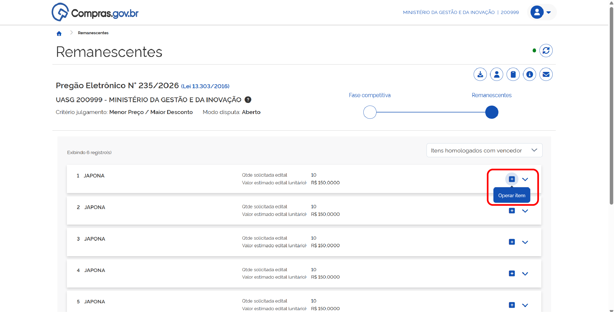
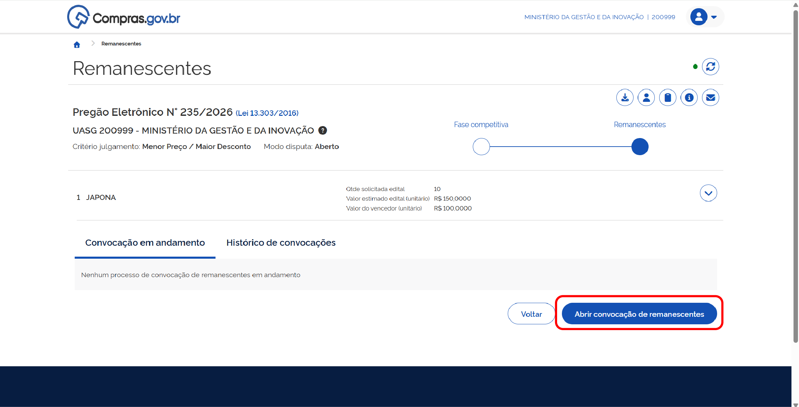
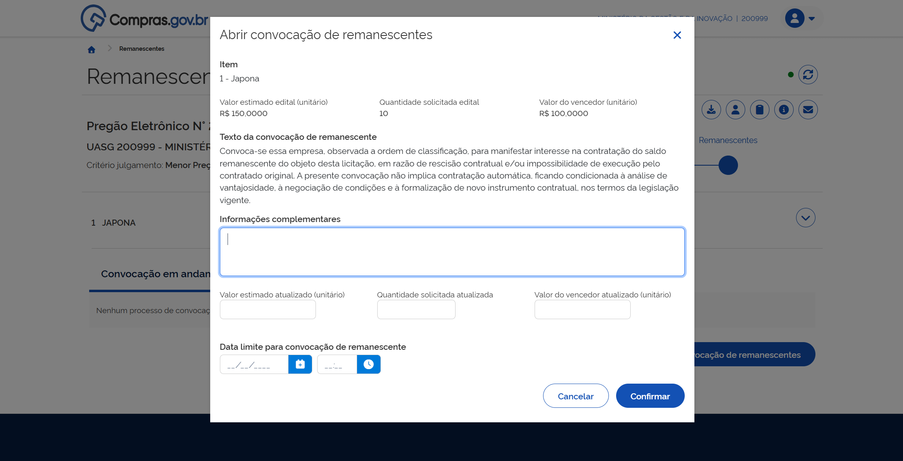
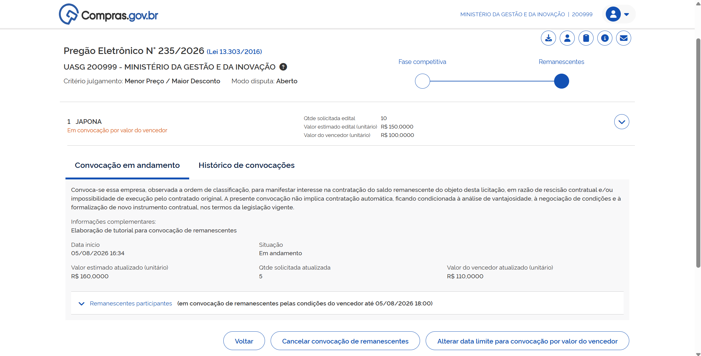

  Tamanho do texto:
  <button onclick="diminuirFonte()" title="Diminuir texto" style="padding: 6px 12px; font-weight: bold; cursor: pointer; border: 1px solid #ccc; border-radius: 4px; background: #f8f9fa;">A-</button>
  <button onclick="resetarFonte()" title="Tamanho normal" style="padding: 6px 12px; font-weight: bold; cursor: pointer; border: 1px solid #ccc; border-radius: 4px; background: #f8f9fa;">A</button>
  <button onclick="aumentarFonte()" title="Aumentar texto" style="padding: 6px 12px; font-weight: bold; cursor: pointer; border: 1px solid #ccc; border-radius: 4px; background: #f8f9fa;">A+</button>
  
  <button onclick="window.print()" style="background-color: #0056b3; color: white; padding: 6px 16px; border: none; border-radius: 5px; font-size: 14px; cursor: pointer; box-shadow: 0 2px 4px rgba(0,0,0,0.2); margin-left: 10px;">
    🖨️ Imprimir ou baixar esta página
  </button>

# ACESSANDO UMA CONTRATAÇÃO HOMOLOGADA

**Passo 1:** No [Portal de Compras do Governo Federal](https://www.gov.br/compras/pt-br), clique em “Acesso ao Sistema”.

**Passo 2:** Escolha o perfil **Governo** e clique em “Entrar com Gov.br”.

**Passo 3:** Na área de trabalho do usuário Governo, localize sua contratação homologada na coluna “Compras Finalizadas”.

**Passo 4:** Selecione sua contratação e acesse “Visualizar atas e termos”.

**Passo 5:** Na linha do tempo da contratação, clique em “Remanescentes”.

# INICIANDO UMA CONVOCAÇÃO DE REMANESCENTES

**Passo 1:** Na linha do tempo da contratação, clique em “Remanescentes”. Em seguida, clique no ícone **+** (Operar item).

**Passo 2:** Clique em “Abrir convocação de remanescentes”.

**Passo 3:** Preencha os dados da convocação, inclusive os preços atualizados, caso o contrato a ser firmado já tenha passado por atualizações. Em seguida, clique em “Confirmar”.

**Passo 4:** Aguarde o final do prazo para análise de fornecedores interessados.

!!! note "Etapas da Convocação"
    A convocação de remanescentes acontecerá em duas etapas:
    
    1. **Aceite para assumir o contrato pelo mesmo preço do licitante vencedor** do processo licitatório;
    2. Caso a primeira etapa não tenha sucesso, será aberta a possibilidade de **aceite para assumir o contrato após negociação de valor**, incluindo a manutenção da proposta original do licitante interessado.

# ANALISANDO FORNECEDORES – ACEITE PELO PREÇO DO VENCEDOR

Após o final do prazo final para manifestação de interesse, o agente de contratação poderá passar à fase de análise. O sistema apresentará todos os fornecedores que se propuseram a assumir o remanescente do contrato pelo valor do vencedor da licitação.

**Passo 1:** Acesse sua contratação. Na linha do tempo, clique em “Remanescentes” e depois em “Operar item”.

A lista de fornecedores é apresentada na ordem em que deve ser analisada, considerando a classificação dos fornecedores na licitação original.

Na aba de proposta, estão as informações do item oferecido pelo fornecedor, além das opções de “Desclassificar”, “Inabilitar” e “Aceitar e habilitar pelas condições do vencedor”.

**Passo 2:** Para solicitar anexos do fornecedor, na aba “Anexos”, clique em “Solicitar envio de anexos”.

Preencha data e hora limite, descreva os anexos solicitados e confirme.

A solicitação foi enviada ao fornecedor.

**Passo 3:** Quando o prazo definido terminar ou o fornecedor enviar os documentos, o sistema exibirá que o processo foi encerrado. 

Acesse a aba de anexos para visualizar os documentos.

**Passo 4:** Para enviar mensagens ao fornecedor que está sendo analisado, acesse a aba “Chat” e acompanhe a troca de mensagens. Caso seja necessário, é possível encerrar a conversa com o fornecedor usando o botão “Desabilitar chat com participante”.

**Passo 5:** Para desclassificar o fornecedor, clique em “Desclassificar”.

Escreva a justificativa e confirme.

A opção pode ser desfeita clicando em “Desfazer desclassificação”.

**Passo 6:** Para inabilitar o fornecedor, clique em “Inabilitar”.

Escreva a justificativa e confirme.

A opção pode ser desfeita clicando em “Desfazer inabilitação”.

**Passo 7:** Para aceitar o fornecedor, clique em “Aceitar e habilitar pelas condições do vencedor”.

Escreva a justificativa e confirme.

A opção pode ser desfeita clicando em “Desfazer aceite e habilitação”.

Escreva a justificativa e confirme.

**Passo 8:** Caso esteja tudo certo e você tenha um fornecedor habilitado, clique em “Encerrar convocação de remanescente”.

Escreva a justificativa e confirme.

**Passo 9:** Se não a primeira convocação de remanescentes não tiver êxito, clique em "+ (Operar item)" e depois em “Convocar remanescentes para negociação” e repita os passos com o próximo fornecedor.

# ANALISANDO FORNECEDORES – ACEITE PARA NEGOCIAÇÃO

**Passo 1:** Para iniciar uma convocação para negociação com fornecedores, acesse o item clicando em “+ (Operar item)”.

**Passo 2:** Clique em “Convocar remanescentes para negociação”.

**Passo 3:** Preencha o campo “Data limite para convocação de remanescente” para definir o prazo para manifestação de interesse pelos fornecedores e confirme. 

**Passo 4:** O prazo final foi definido. Caso deseje alterar data e/ou horário final, clique em “Alterar data limite para negociação”.

**Passo 5:** Finalizado o prazo dado aos fornecedores, retorne ao item e clique em “Operar item”.

**Passo 6:** A lista de fornecedores estará na ordem em que deve ser analisada, considerando a classificação dos fornecedores na licitação original.

!!! note "Procedimentos Repetidos da Etapa Anterior"
    * Para solicitar envio de anexos, siga os passos 2 e 3 da seção **[Analisando Fornecedores – Aceite pelo Preço do Vencedor](03-analisando-fornecedores-vencedor.md)**.
    * Para envio de mensagens, siga o passo 4 da seção **[Analisando Fornecedores – Aceite pelo Preço do Vencedor](03-analisando-fornecedores-vencedor.md)**.
    * Para desclassificar o participante, siga o passo 5 da seção **[Analisando Fornecedores – Aceite pelo Preço do Vencedor](03-analisando-fornecedores-vencedor.md)**.
    * Para inabilitar o participante, siga o passo 6 da seção **[Analisando Fornecedores – Aceite pelo Preço do Vencedor](03-analisando-fornecedores-vencedor.md)**.

Para iniciar a negociação, expanda as informações do fornecedor e selecione a opção “Negociar”.

Preencha os campos de “Valor sugerido” e “Justificativa” e confirme.

A negociação foi iniciada.

**Passo 7:** Caso o fornecedor faça uma contraproposta para a negociação, analise o pedido. Se preferir iniciar uma nova negociação, clique em “Negociar”.

Preencha os dados da nova negociação e confirme.

Caso aceite a contraproposta do fornecedor, clique em “Aceitar e habilitar pelo valor negociado”.

Escreva a justificativa e confirme.

Clique em “Encerrar convocação de remanescentes”.

Escreva a justificativa e confirme.

**Passo 8:** Caso o fornecedor rejeite a negociação, o sistema apresentará indicação de negociação fracassada.

O servidor público responsável pela negociação poderá escolher entre:

* “Desfazer fracasso na negociação”, opção que reabrirá a negociação com este fornecedor;
* Negociar com o próximo fornecedor habilitado para esta etapa;
* Ou encerrar o processo de convocação de remanescentes.

**Passo 9:** Caso o fornecedor aceite a proposta, selecione “Aceitar e habilitar pelo valor negociado”.

Escreva a justificativa e confirme.

Clique em “Encerrar convocação de remanescentes”

Escreva a justificativa e confirme.

# CANCELANDO, HISTÓRICO E ALTERAÇÃO DE DATA

## CANCELANDO UMA CONVOCAÇÃO DE REMANESCENTES

A convocação de remanescentes poderá ser cancelada a qualquer momento. Para isso, siga os passos abaixo: 

**Passo 1:** Clique em “Cancelar convocação de remanescente”.

**Passo 2:** Escreva a justificativa para o cancelamento e confirme.

!!! warning "Atenção"
    Essa ação não poderá ser desfeita. Caso seja necessário, inicie um novo processo de convocação de remanescentes.

Na aba “Histórico de convocações”, você pode visualizar as informações de todas as convocações de remanescentes já finalizadas e fazer download do relatório de cada uma delas.

## ALTERANDO A DATA LIMITE DA CONVOCAÇÃO

Caso seja necessário alterar data ou horário limite da convocação, clique em “Alterar data limite para convocação”.

Escreva a nova data e horário, justifique e confirme.

 

  <button onclick="window.print()" style="background-color: #0056b3; color: white; padding: 10px 20px; border: none; border-radius: 5px; font-size: 16px; cursor: pointer; box-shadow: 0 2px 4px rgba(0,0,0,0.2);">
    🖨️ Imprimir ou baixar esta página
  </button>

